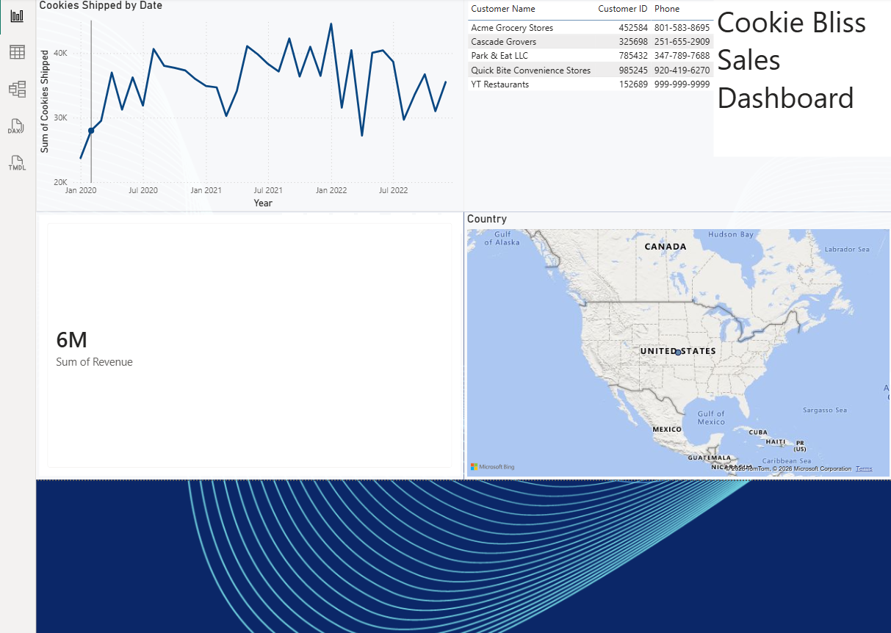
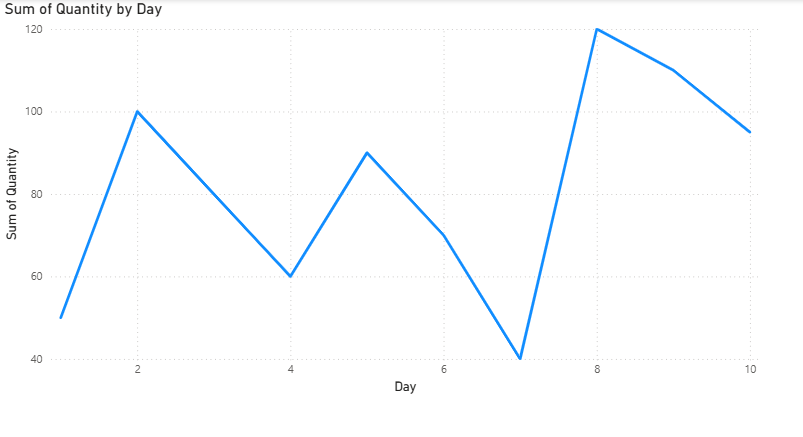
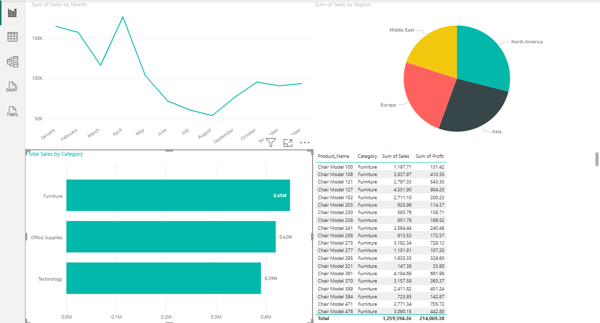
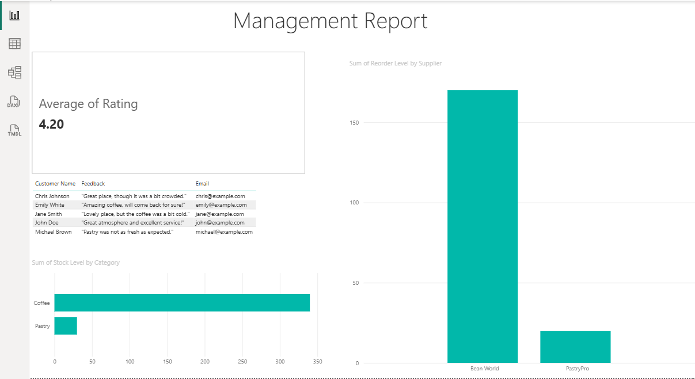

# 📊 Power BI Project Portfolio

A collection of four end-to-end business intelligence dashboards built with Power BI, covering sales analytics, customer insights, retail performance, and executive reporting. Each project involved raw data extraction, cleaning and transformation in Power Query, custom DAX measures, and interactive dashboard design.

---

## 📁 Projects Included

| # | Project | Focus Area | Rows Analysed |
|---|---------|------------|---------------|
| 1 | [Global Sales Analytics Dashboard](#1-global-sales-analytics-dashboard) | Sales KPIs, Regional Performance | 10,000+ |
| 2 | [Customer Insights Report](#2-customer-insights-report) | Churn, LTV, Segmentation | Multi-segment |
| 3 | [Retail Sales Performance Dashboard](#3-retail-sales-performance-dashboard) | Product Profit, Time-Series | — |
| 4 | [Business Performance Insights Dashboard](#4-business-performance-insights-dashboard) | Executive KPIs, Data Storytelling | — |

---

## 1. Global Sales Analytics Dashboard

**Overview:**
Cleaned and transformed a 10,000+ row global sales dataset using Power Query, resolving regional data inconsistencies and standardising date and currency formats across 6 geographic regions. Built an interactive Power BI dashboard to monitor business performance and support data-driven decision-making.

**Key Features:**
- Tracked 8 core business KPIs including revenue, profit margin, order volume, and fulfilment rate
- Regional performance comparison across 6 global markets with drill-down by product category
- Time-series trend analysis enabling period-over-period sales comparisons
- Dynamic slicers for interactive filtering by region, product category, and date range
- Data integrity validation applied during Power Query transformation stage

**Tools & Technologies:** Power BI · Power Query · DAX · Microsoft Excel

**Skills Demonstrated:** Data Extraction · Data Cleaning · KPI Modelling · Dashboard Design · Trend Analysis

---

## 2. Customer Insights Report

**Overview:**
Analysed customer demographics and membership data spanning 5 segments using custom DAX measures to compute churn indicators and customer lifetime value (LTV) proxies. Designed a multi-page report enabling behavioural trend analysis for business reporting.

**Key Features:**
- Custom DAX measures for churn rate indicators and lifetime value proxies across 5 membership tiers
- Multi-page Power BI report with dynamic slicers for age group, region, and membership tier
- Customer segmentation analysis surfacing behavioural patterns by demographic group
- Drill-through pages enabling navigation from summary metrics to individual segment detail
- Interactive visuals supporting actionable insights for retention and acquisition strategy

**Tools & Technologies:** Power BI · DAX · Microsoft Excel

**Skills Demonstrated:** Customer Analytics · DAX Modelling · Segmentation · Churn Analysis · Behavioural Reporting

---

## 3. Retail Sales Performance Dashboard

**Overview:**
Developed a retail-focused dashboard analysing product-level sales and profitability. Applied time-series visualisations to surface seasonal trends and built profit tracking views to support category management decisions.

**Key Features:**
- Product-level performance analysis with profit margin breakdown by category and SKU
- Time-series visualisations for monthly and quarterly revenue tracking
- Profitability heatmaps identifying high-margin vs underperforming product lines
- Business insight callouts highlighting key findings directly within the report canvas
- Slicers for filtering by product category, store location, and time period

**Tools & Technologies:** Power BI · Power Query · DAX · Microsoft Excel

**Skills Demonstrated:** Retail Analytics · Profit Tracking · Time-Series Analysis · Data Visualisation · Dashboard Design

---

## 4. Business Performance Insights Dashboard

**Overview:**
Built an executive-facing business intelligence dashboard consolidating cross-functional KPIs into a single reporting view. Focused on data storytelling, visual hierarchy, and clear presentation of performance metrics for senior stakeholder consumption.

**Key Features:**
- Executive KPI summary cards for revenue, costs, growth rate, and operational metrics
- Interactive visuals designed for non-technical stakeholder audiences
- Data storytelling layout guiding viewers from high-level summary to root cause detail
- Performance benchmarking with target vs actual comparisons
- Clean, professional report design aligned with business intelligence best practices

**Tools & Technologies:** Power BI · DAX · Power Query · Microsoft Excel

**Skills Demonstrated:** Executive Reporting · Data Storytelling · KPI Dashboard Design · BI Best Practices · Stakeholder Communication

---

## 🛠️ Tools & Technologies

| Tool | Usage |
|------|-------|
| **Power BI Desktop** | Dashboard development, report design, data modelling |
| **Power Query (M)** | Data extraction, cleansing, and transformation |
| **DAX** | Custom measures, KPI calculations, churn & LTV logic |
| **Microsoft Excel** | Source data preparation and validation |

---

## 🧠 Skills Demonstrated

- Data Extraction, Cleansing & Transformation
- Exploratory Data Analysis (EDA)
- KPI Modelling & Business Metrics Design
- Trend Analysis & Anomaly Detection
- Customer Segmentation & Churn Analysis
- Interactive Dashboard & Report Design
- Data Storytelling & Stakeholder Communication
- Audit Trail Documentation (methodology + transformation logs)

---

## 👤 Author

**Safwanul Hoque**
Bachelor of Computer Science (Data Analytics) · Asia Pacific University (APU) · Dual Degree with De Montfort University, UK

🔗 [LinkedIn](https://linkedin.com/in/safwanul-hoque) · 📧 safwanul.hoque.safwan@gmail.com 
